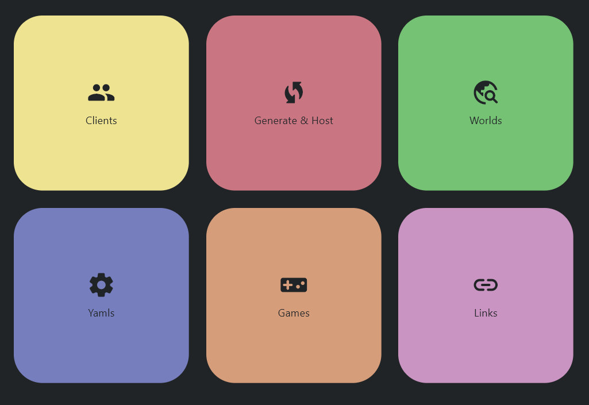
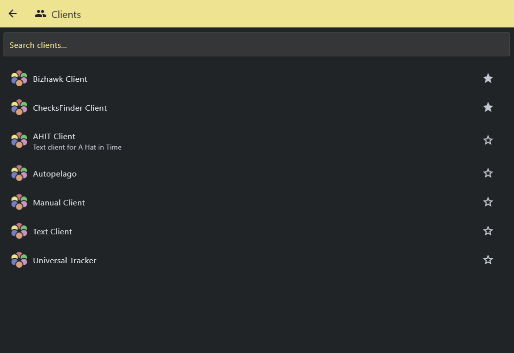
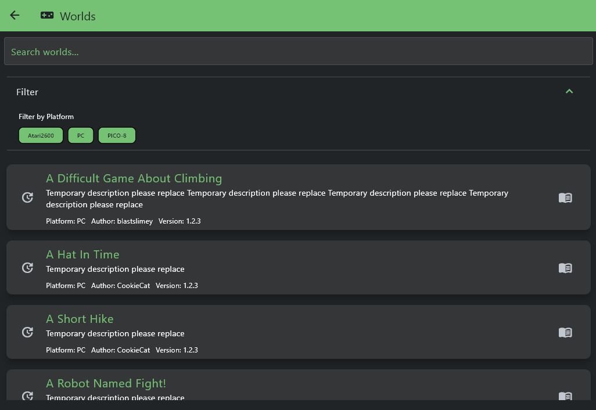
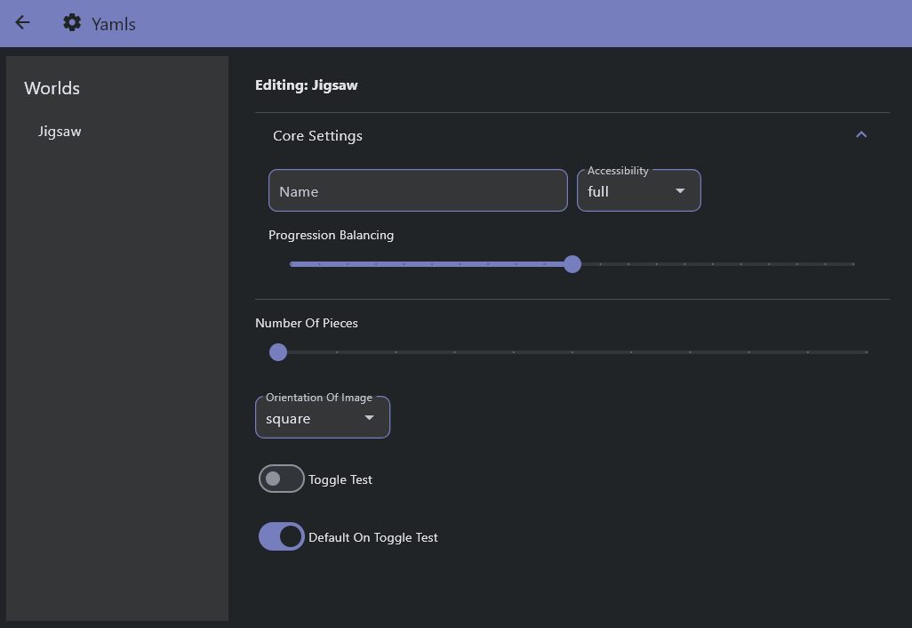
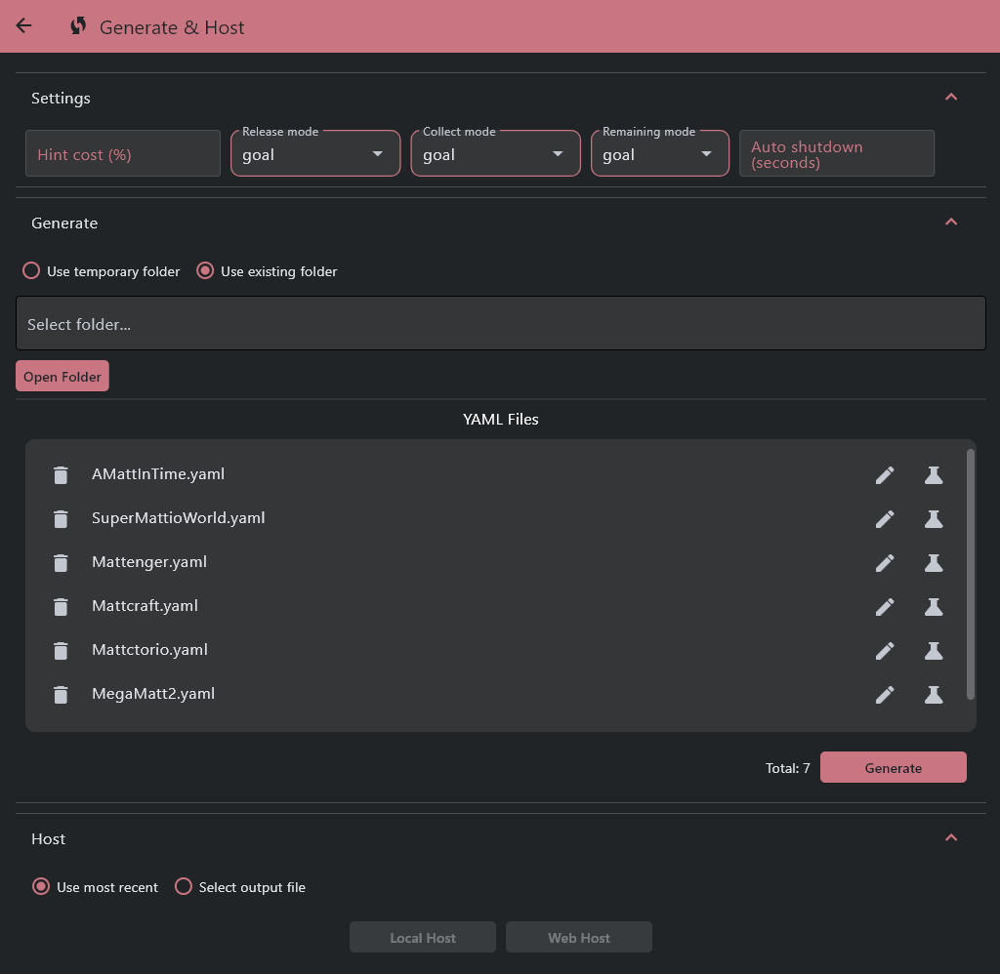
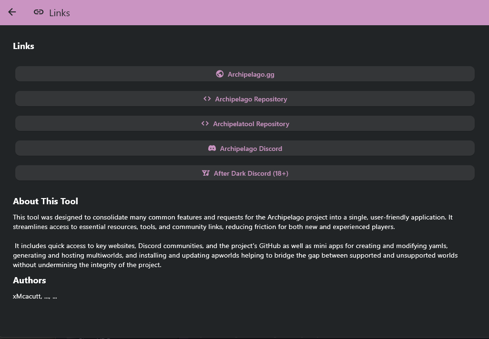

# Archipelatool

This application is designed as a solution to a lack of consolidation
of tools and resources within the Archipelago project. It aims to provide 
mini-apps to aid in managing yamls and apworlds, generate and host multiworlds,
and access community resources.

Part of the difficulty in developing tools for Archipelago is the strict python integration
making complicated interop code including additional python conversions necessary when 
working in other languages. To avoid this, the framework used for this project is [flet](https://flet.dev/).

Flet is a python based imitation of Google's flutter framework and features a modern style following material design guidelines.
The goal of this project is for it to be a plug and play directly integrating
with the Archipelago project without alterations to the Archipelago source.

## Goals
### Faster Load Times
Currently, when booting the Archipelago launcher, all apworlds are loaded via python module initialization.
This is because some apworlds contain clients and discovery of these clients is currently handled by loading the world
where it extends the global components list. This is unavoidable with the current apworld setup but there are features of the launcher which
do not require loading the worlds leading to long and unnecessary loads.

The proposed (though imperfect) solution to this is to lazily load the worlds only when certain features of this tool are accessed.
The generic tools like the text client and external links will be accessible directly from the main menu meaning the clients are only loaded when required.

### World Management
Projects designed to index or manage all apworlds are not a new idea but having this directly integrated
into the launcher is. The theory behind the proposed system is to have a json or xml file which contains the 
data required for indexing and downloading each apworld. To avoid asking developers to provide this upfront, the goal is to
initially grab every available apworld from the [index](https://discordapp.com/channels/731205301247803413/1343416927871307776) created by [eudaimonistic](https://github.com/eudaimonistic) and manually add them to the global directory.
This will be hosted on github and adding your new apworld will be as simple as making a pull request to the file to add the necessary data.

When the `Games` view is accessed in the tool, the directory file is downloaded and all worlds are loaded into the view with 
filtering by development phase and platform as well as a text search.

### YAML Management
Yaml editing and management tools are also not a new concept. However, by integrating the feature into this tool, yamls can be
modified and exported by changing basic controls and then loaded in for generation through drag and drop. Any mistakes can then easily be modified
before generation and the yamls can be unit tested for generation to spot generation issues early.

### Generation & Hosting
The current workflow for generating for a multiworld is to clear your Players directory, move all player yamls into the directory,
then generate. Then run the generator app. You'll then need to make sure your host settings are correct by modifying your host yaml
before running the host app or going to the Archipelago website and uploading to the webhost. Any mistakes require repeating at least part of the process.

This tools aims to make this more seamless by allowing the path to be chosen from the tool. Key host settings are also 
deserialized making it much easier to modify the release mode, hint cost, etcetera  between generations.

## Contributing

To contribute to this project simply clone, make changes, and pull request. You can also contact me in the [Archipelago Discord's 
Archipelatool thread](https://discordapp.com/channels/731205301247803413/1362669968042491974) to register your interest and discuss what needs completing.

